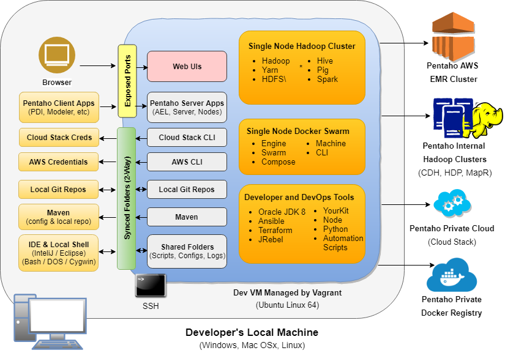

# Pentaho Hadoop Development Environment

Here's what's you get:

* An **Ubuntu Linux** virtual machine running on your laptop.
* A working **Apache hadoop cluster** with echosystem apps set up and running:  hdfs, yarn, hive, spark, etc.
* **Docker Swarm Node**, so he can deploy apps onto your laptop super easy and test your own apps in containers. 
* **Folders are synced** between your desktop and VM.  So he can switch back and forth.  Develop in your favorite Windows IDE.  Test against hadoop cluster in your VM.  No copying or SCPing files.
* **Maven and git are synced**.  Maven in your VM will use same config file and local repo as desktop. 
* **CLI tools** to access and **deploy** apps easily to **cloud providers**, like AWS, Google Cloud, and our own internal Cloud Stack.
* **Automation Scripts** to make using, developing, and testing Pentaho apps easier.  Scripts to:
  - Download and install latest QAT and snapshot versions of Pentaho Builds
  - Configure hadoop shims, AEL, server, and others
  - Copy code changes and updated .jars to install, clearing karaf caches if needed.
* **Ports are exposed** from VM to your desktop.  So, accessing **Web UIs** running in your VM is easy as typing "http://localhost<port-number>" into your browsewr
  - (Spark yourtory Server, Yarn Resource Manager, Pentaho Server, etc)
* [AND on top of all that](https://www.youtube.com/watch?v=TJoBMayjlUo) he's running **[JRebel](https://zeroturnaround.com/software/jrebel/)**.  So he can **immediately see and test your Java code changes** to pentaho products running in the VM.  
  - No having to run a maven build, copy jars, clear karaf caches, restart pentaho apps.  
  - What used to take 2 - 3 minutes per change now takes seconds.  Increasing your feedback loop and dramatically speeding up your developmet.
  - That REALLY makes that guy excited.  He's gonna have to step away from the coffee for a while.
  
  Alright, enough yakkety yak.  Time to clackity clack.  